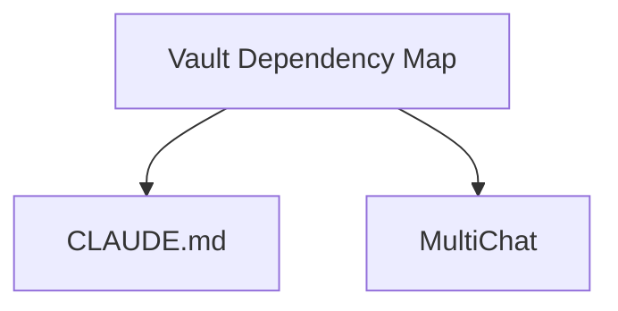

# Vault Dependency Map

Generated automatically on: **24.05.2026, 19:38:28**
Directory: `C:\Users\Kuba\Documents\GitHub\MultiChat`

## Files mapped

- **CLAUDE.md** (`CLAUDE.md`)
- **MultiChat** (`README.md`)
- **Vault Dependency Map** (`vault_map.md`)

## Connection Graph

## Connection Details

| Source File | Target File | Connection Reason |
| --- | --- | --- |
| **Vault Dependency Map** | **CLAUDE.md** | The active file lists this file in the 'Files mapped' section and the Mermaid connection graph as a source node in the dependency graph. |
| **Vault Dependency Map** | **MultiChat** | The active file lists this directory in the 'Files mapped' section and the Mermaid connection graph as a target node in the dependency graph. |
